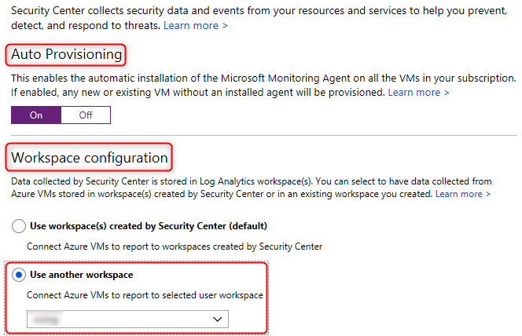

# ASC Automation & Configuration

In this lab you are going to explore what the ASC automation and deployment options are.
mail notification settings
You will configure ASC with:
1. ARM Templates
2. PowerShell

 
### ARM Template deployment
#### 1 - Explore the ASC settings in the portal
1. Open a browser and login to the  <a href="https://portal.azure.com" target="_blank">Azure Portal</a>
2. Click on **Security Center**
3. Click on **Security Policy**
4. On the line where it shows your subscription, click on **Edit settings**
5. Explore the settings, specifically the email notification settings.

For the ARM deployment lab we are going to start with the **Email notification** settings

#### 2 - Explore the Email Notifications ARM template
1. Open the <a href="https://github.com/tianderturpijn/Azure-Security-Center/blob/master/Labs/01%20-%20Automation/Files/configureAscEmailNotifications.json" target="_blank">ARM template</a> for email notifiations
2. Notice the ARM template parameter allowed values. These values are case sensitive and are mandatory.
3. Under the ARM resources (securityContacts), use "default1", "default2", etc. as the name. These are mandatory fields and can only be used in this format

#### 3 - Deploy the Email Notifications ARM template
**Assumptions**: You have installed the AzureRm PowerShell modules on your system.  If not, install those using *Install-Module -Name AzureRM*
1. Open your favorite PowerShell editor
2. Login to the Azure Portal by using **Login-AzureRmAccount**
3. Make sure that you have selected your Azure subscription which has been provided to you by using **Select-AzureRmSubscription** 
4. ASC resides at the subscription level, so we are going to target our ARM template deployment at the same level (instead of deploying at the resource group level)
5. The syntax is New-AzureRmDeployment -TemplateFile `yourArmTemplateFile` (note: we are going to use a prepared ARM template JSON file)
6. Type the following in your PowerShell session (don't click on the hyperlink) and execute it: **New-AzureRmDeployment -TemplateFile <a href="" target="_blank">'https://raw.githubusercontent.com/tianderturpijn/Azure-Security-Center/master/Labs/01%20-%20Automation/Files/configureAscEmailNotifications.json'**</a>
7. After a successful completion, switch to the Azure portal and refresh the ASC blade and verify that the email settings have been updated

#### 4 - Deploy a full ASC configuration ARM template
Now that you have explored how to deploy an ARM template to configure an ASC setting, you are going to explore how to deploy a more comprehensive ARM template.  
ASC stores MMA collected data (and more) in a Log Analytics workspace. In a more complex environment, you will often find an existing Log Analytics workspace which needs to be integrated with ASC (aka a Central Workspace).  
The following lab assumes that a (Central) Log Analytics workspace already exists (although this can be deployed with an ARM template at the same time) and you are going to configure ASC to use the existing Log Analytics workspace. 

